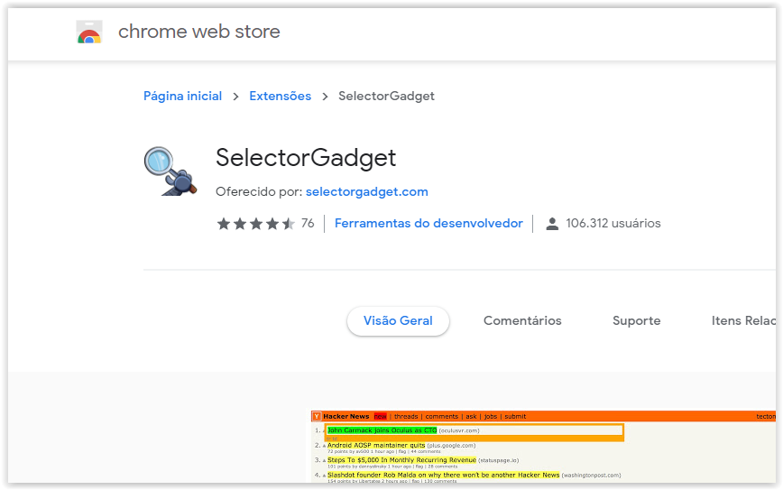
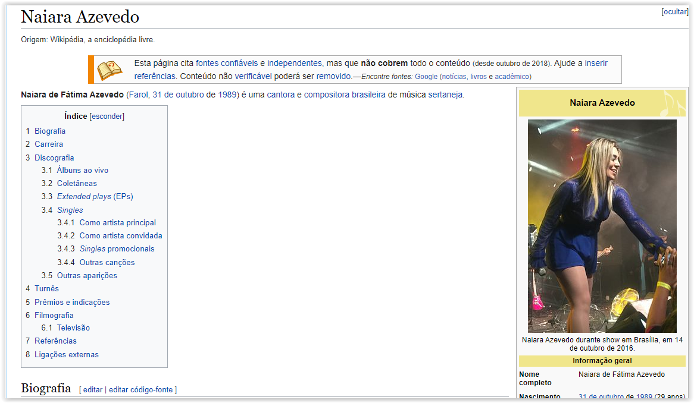
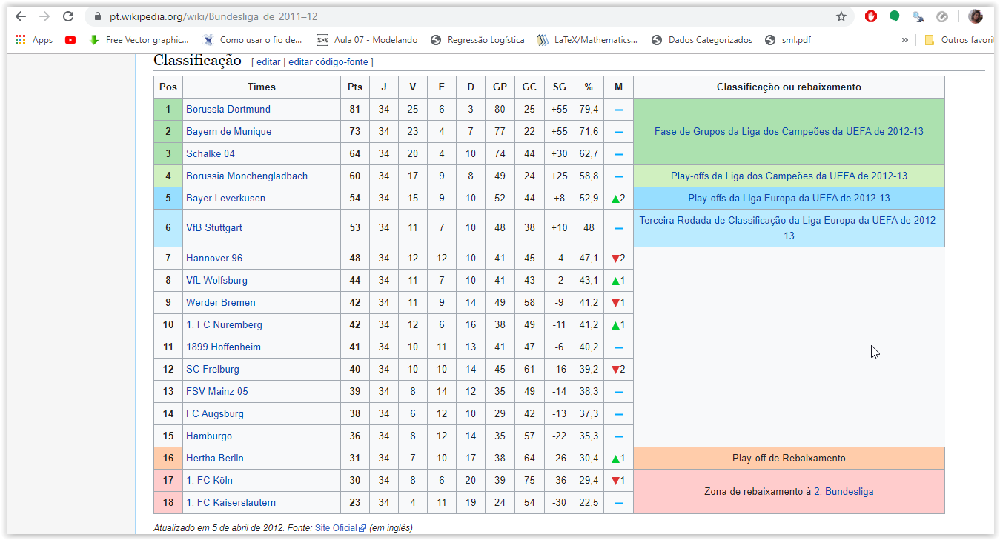
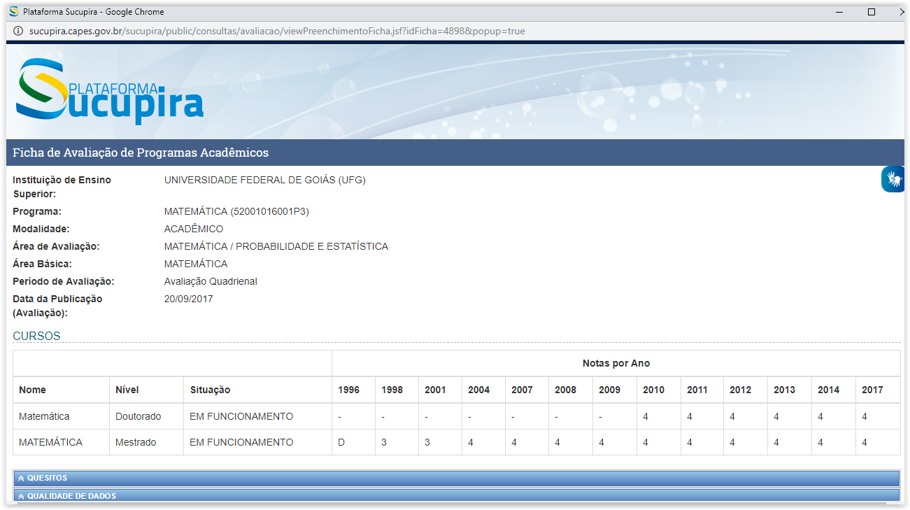
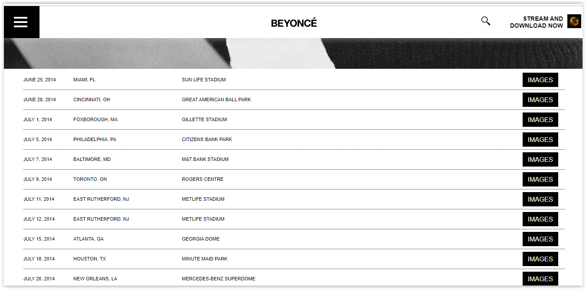
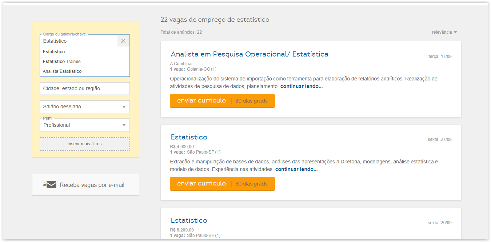

```{r setup, include=FALSE}
knitr::opts_chunk$set(echo = TRUE)
library(tidyverse)
```

# Introdução

## O que é

- Técnica de extrair dados de websites.  
- Tirar vantagem da estrutura das web páginas para extrair e armazenar dados em um formato para análise de dados.  

## Por que usar

- Formato dos Dados
- Não precisa copiar e colar
- Sem salvar/baixar (sem essa opção)
- Automação

## Casos de Uso

- Comparação de preços;  
- Review de produtos;  
- Informações de esportes;  
- Dados de media social.  


# Conhecimentos adicionais

## Package magrittr

```
install.packages(magrittr)
```


## Entendendo o Pipe %>% 

- `x %>% f` é equivalente a `f(x)`  
- `x %>% f(y)` é equivalente a `f(x, y)`  
- `x %>% f %>% g %>% h` é equivalente a `h(g(f(x)))`  

## 

```{r}
x <- c(0.109, 0.359, 0.63, 0.996, 0.515, 0.142, 0.017, 0.829, 0.907)

round(exp(diff(log(x))), 1)
```

```{r}
x %>% 
  log() %>% 
  diff() %>% 
  exp() %>% 
  round(1)
```

atalho para o pipe `ctrl+shft+m`  

## Packages

- xml2  
- httr  
- rvest  

```
install.packages('rvest')
```
## Selector Gadget

- HTML  
- CSS  




# Meus Exemplos

## Influencia Artistas



## Bundesliga



## CAPES



## Tour Beyonce



## Empregos Estatístico




# Aplicação

## 
- Informação sobre filmes  
- Remuneração de todos os servidores ativos do Ministério Público de Goiás  

# Obrigada
